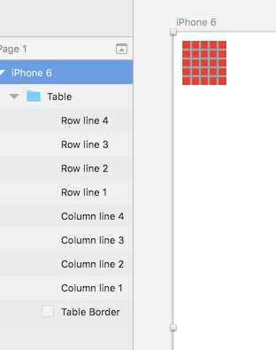

# Sketch-DrawTable
Sketch Plugin for drawing table

# What it does
 
 It help user to create a M x N table with basic line shapes.

# Screenshots

Configure table, number of rows and number of columns, cell width, cell height

All shapes are named with index

# Install

Download and put the "DrawTable.sketchplugin" into "~/Library/Application Support/com.bohemiancoding.sketch3/Plugins/", retstart sketch.

# Road map

1. Add symbol style for lines and border

# References

1. [Sketch example plugins](http://developer.sketchapp.com/examples/plugins/), this plugin started from hello-world.
2. [Code snippets](http://developer.sketchapp.com/examples/code/), dialog code is from here.

